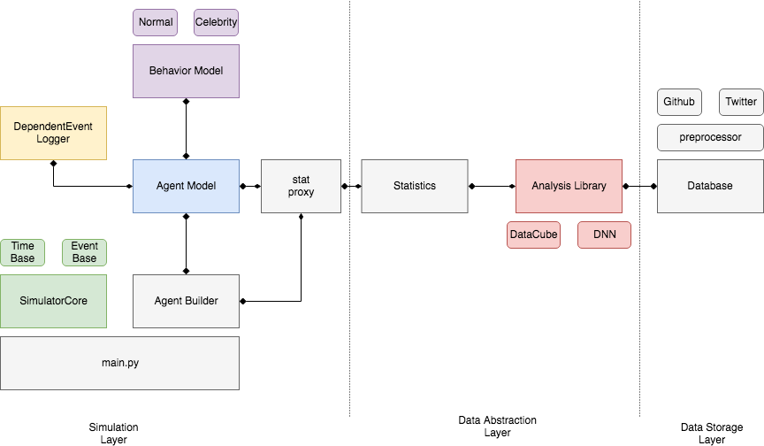

## SocialCube - A Multiscale Modeling and Simulation Framework for Social Streams

#### Overview
This repository contains framework code for SocialCube, a multiscale modeling and simulation framework for social streams.

#### Architecture
The following diagram shows a high level architecture of the framework.


##### Runtime modules
These modules are invoked in simulation runtime.

* __SimulatorCore__: there are time based simulator core and event based simulator core. Current implementation only contains time based simulator core for fast development and experiment.
* __Agent Builder__: responsible for getting a list of agent id, and initialize each agent based on a specific agent model.
* __Agent Model__: an agent class that describes user of certain social community.
* __Behavior Model__: describes "personality" of an agent. Technically, it describes how an agent should behave given certain probability.
* __DependentEvent Logger__: responsible for updating simulated action into database, and querying past history of agents. It is only used when behavior model take dependent relationship into account.
* __stat proxy__: get statistics from files generated by AnalysisLib. This is where Agent Builder and Agent Model gets their statistics.

##### Offline modules

* __Analysis Library__: responsible for analyzing dataset and build initial statistics and probability. This is a offline module. It generates statistics and store them into a file for runtime usage.

#### Setup
This project relies on pylint to do pre-commit lint checking. We also use format.sh within script folder to automatically format our code. Please install following packages before you get started with development:
```
$ sudo apt install pylint
$ sudo pip install yapf
```

Follow these steps when setup in Debian based OS:
```
$ bash setup.sh
$ source ~/.profile
```
